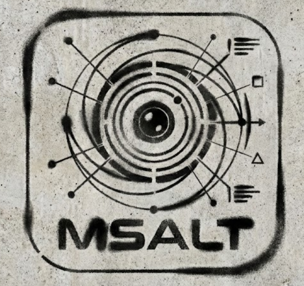
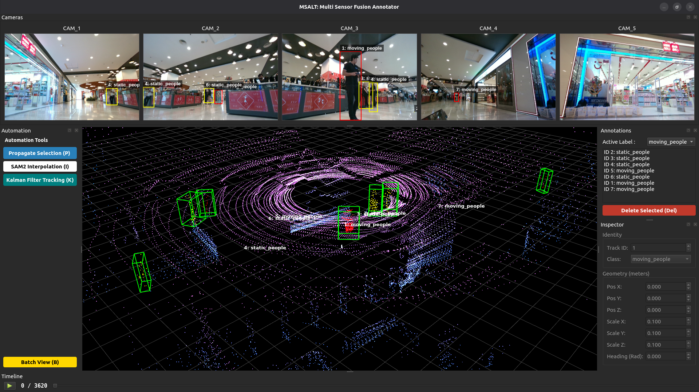
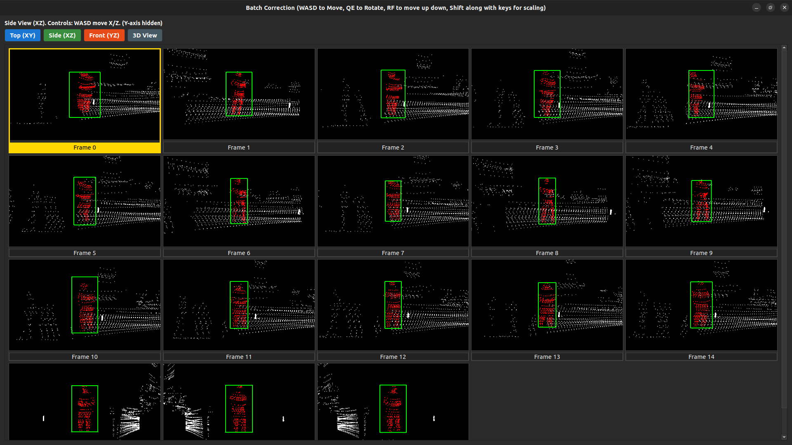
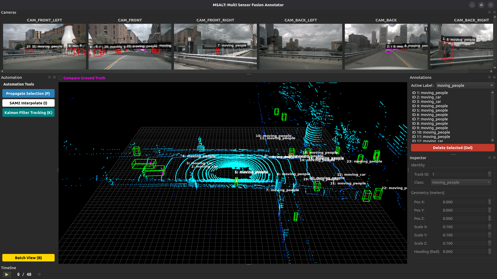

<div align="center">
  

# MSALT (Multi Sensor Annotation & Labelling Tool)
[](https://github.com/LiDAR-Motion-Segmentation/MSALT/actions/workflows/ci.yml)
[](https://releases.ubuntu.com/jammy/)
</div>

## 3D Sensor Fusion Annotation Tool
MSALT is a high-performance, open-source annotation tool designed for sensor fusion tasks. It bridges the gap between 2D camera imagery and 3D LiDAR point clouds, offering AI-assisted labeling workflows to accelerate dataset creation for autonomous robotics.

### Features:

- Multi-Sensor Fusion: Seamlessly project 3D LiDAR points onto 2D camera frames and vice-versa.
- AI-Assisted Labeling: Integrated SAM 2 (Segment Anything Model) for automatic object segmentation.
- Automation Pipeline: Features linear propagation and "Copy-to-Next" automation to label sequences 10x faster.
- Semantic Point Clouds: Auto-colors LiDAR points based on the semantic class of the 2D bounding box.
- Split-State Saving: Decouples clean 3D datasets (.json) from editor metadata, ensuring compatibility with standard ML pipelines.
- Modular Config: Flexible YAML-based configuration for different robot platforms (e.g., Husky, SemanticKITTI).
- Batch editing: Easy editing with multiple 3D bounding box view for a set of sequences.

## Installation
- You can setup the tool `locally` or using `Docker(Devcontainer)` setup whose intructions are mentioned towards the end of this `readme.md` file
```python3
# MSALT uses uv for blazing fast dependency management.
git clone https://github.com/LiDAR-Motion-Segmentation/MSALT.git
cd MSALT

# Install uv (if not already installed)
curl -LsSf https://astral.sh/uv/install.sh | sh

# Sync dependencies (creates virtual env automatically)
uv sync

# on terminal in the root of the folder
chmod +x msalt
./msalt

# or use to run with uv
uv run main.py
```


## Model weights
- Download the SAM 2 checkpoints and place them in the checkpoints/ directory (create if missing).
- [Download sam2_hiera_large.pt](https://github.com/facebookresearch/sam2)

## Controls & shortcuts
| Context | Key / Action | Description |
| :--- | :--- | :--- |
| **Navigation** | `Left Arrow` / `Right Arrow` | Previous / Next Frame |
| **Selection** | `Left Click` (3D View) | Select a Bounding Box |
| **Editing** | `Mouse Drag` (2D View) | Draw a new Box (Trigger SAM2) |
| **Automation** | `P` | **Propagate** selected box to next frame |
| **Interpolation** | `I` | **Interpolate** selected box to next frame |
| **Tracking** | `K` | **Track** selected box to next frame without images |
| **Management** | `Del` | Delete selected box |
| **System** | `Ctrl + S` | Force Save (Auto-save is on by default) |
| **Undo** | `Ctrl + Z` | Undo changes |
| **Redo** | `Ctrl + Y` | Redo changes |
| **3D Box Drawing** | `Ctrl + Left Click` | Draw a new Box directly on 3D viewer|
| **3D Box Drawing Cancellation** | `Esc` | To cancel the box drawn on 3D viewer
| **3D View** | `Left Drag` / `Right Drag` | Rotate / Pan Camera |
| **3D View** | `Scroll` | Zoom In / Out |
| **3D Box allignment** | `R` | PCA trigger for correct 3D box allignment |
| **Batch View** | `B` | Batch mode of (4x4) set of frames |


<!-- <video src="./assets/annotation_video_box_editing.mp4" controls title="A short video demonstration" width="600">
</video> -->

## Batch mode editing

- How it works :
1. Open Batch View (B).
2. You see 16 frames. Frame 10 has the box slightly too far left.
3. Click Frame 10. It glows Yellow.
4. Press D tap-tap-tap. The box moves right instantly.
5. Press Q. The box rotates slightly.

| Action        | Key       | Shift + Key     |
|---------------|-----------|-----------------|
| Forward/Back  | W / S     | Scale Length    |
| Left/Right    | A / D     | Scale Width     |
| Up/Down       | R / F     | Scale Height    |
| Rotate        | Q / E     | No Change       |

- We have also added the option of `top(XY)`, `side (XZ)`, `front (YZ)` and `reset` for better editing

## Input setup
- MSALT expects your data to be organized as follows. Define the paths in `config/msalt_setup/docker_setup.yaml` or make your own custom file with the paths
```
paths:
  lidar_folder: "/app/data/lidar"

  cameras:
    - id: "CAM_1"
      name: "Front Center"
      image_folder: "/app/data/camera1"
      intrinsics: "/app/data/camera1_intrinsics.txt"
      extrinsics: "/app/data/camera1_extrinsics.txt"
    - id: "CAM_2"
      name: "Front Left"
      image_folder: "/app/data/camera2"
      intrinsics: "/app/data/camera2_intrinsics.txt"
      extrinsics: "/app/data/camera2_extrinsics.txt"
    - id: "CAM_3"
      name: "Front Right"
      image_folder: "/app/data/camera3"
      intrinsics: "/app/data/camera3_intrinsics.txt"
      extrinsics: "/app/data/camera3_extrinsics.txt"
    - id: "CAM_4"
      name: "Rear Left"
      image_folder: "/app/data/camera4"
      intrinsics: "/app/data/camera4_intrinsics.txt"
      extrinsics: "/app/data/camera4_extrinsics.txt"
    - id: "CAM_5"
      name: "Rear Right"
      image_folder: "/app/data/camera5"
      intrinsics: "/app/data/camera5_intrinsics.txt"
      extrinsics: "/app/data/camera5_extrinsics.txt"

extensions:
  images: ".png"
  lidar: ".pcd"
```
- In `config/config.yaml` make the modification where you have put your desired file setup with the paths
```
defaults:
  - msalt_setup: <custom file setup name here>  
  - models: default
  - _self_
```

## Creating custom classes and directories for saving
- in the `config.yaml` you can put your custom path for saving the annotations in which 3d folder will contain the annotations in json format
- in the `labels` section in the `config.yaml` you can store the type of the classes that you want along with the colour coding for 2D boxes and the points inside the 3D bounding box.
- the ones below are the most common classes in autonomous driving datasets, the naming conventions can be a subject to change.

```
output:
  dir: "${hydra:runtime.cwd}/MSALT_outputs_annotations_nuscenes"

labels:
  - name: "moving_people"
    color: [255, 0, 0]        # Bright Red
    hotkey: "1"               
    
  - name: "static_people"
    color: [0, 255, 0]        #  Green
    hotkey: "2"

  - name: "unknown"
    color: [0, 255, 0]        # Green
    hotkey: "3"

  - name: "static_car"
    color: [255, 255, 255]    # white
    hotkey: "4"

  - name: "moving_car"
    color: [255, 0, 255]      # Magenta
    hotkey: "5"

  - name: "moving_truck"
    color: [255, 140, 0]      # Dark Orange 
    hotkey: "6"

  - name: "static_truck"
    color: [255, 20, 147]     # Deep Pink 
    hotkey: "7"

  - name: "moving_bus"
    color: [255, 215, 0]      # Gold 
    hotkey: "8"

  - name: "static_bus"
    color: [128, 128, 0]      # Olive (Dark Yellow-Green) 
    hotkey: "9"

  - name: "moving_cyclist"
    color: [0, 255, 255]      # Cyan (Bright Electric Blue)
    hotkey: "10"

  - name: "static_cyclist"
    color: [102, 0, 204]      # Purple
    hotkey: "11"

  - name: "moving_construction_vehicle"
    color: [255, 20, 147]     # Deep Pink 
    hotkey: "12"

  - name: "static_construction_vehicle"
    color: [199, 21, 133]     # Medium Violet Red 
    hotkey: "13"

  - name: "moving_other_vehicle"
    color: [138, 43, 226]     # Blue-Violet (Neon Purple) 
    hotkey: "14"

  - name: "static_other_vehicle"
    color: [75, 0, 130]       # Indigo (Very Dark Purple)
    hotkey: "15"
```


## Architecture


## Algorithmic Math behind the tool
- 2D-3D back projection math
- Attaching link of the slide deck with in-depth math review and analysis [slides](https://docs.google.com/presentation/d/1bkxz266cf_2n2TrYOkVyRwoABM5PNmgjnWyLDB4iWXU/edit?usp=sharing)


## Directory Structure
- MSALT follows a modular `Model-View-Controller (MVC)` pattern to separate UI logic from geometric processing.
```
├── config
│   ├── config.yaml
│   ├── models
│   │   └── default.yaml
│   └── msalt_setup
│       ├── husky_setup.yaml
│       └── semantic_kitty.yaml
├── Docker
│   ├── Dockerfile
│   └── run_docker.sh
├── debug_config.py
├── main.py
├── pyproject.toml
├── README.md
├── requirements.txt
├── src
│   ├── core
│   │   ├── annotation_manager.py
|   |   ├── commands.py
│   │   ├── geometry.py
│   │   ├── objects.py
│   │   └── segmentation.py
│   ├── data
│   │   ├── data_controller.py
│   │   ├── interfaces.py
│   │   ├── loaders
│   │   │   └── realsense_loader.py
│   │   └── structures.py
│   └── ui
│       ├── components
|       |   ├── annotation_list.py
|       |   ├── automation_panel.py
|       |   ├── batch_view.py
│       │   ├── camera_view.py
│       │   ├── drawable_label.py
|       |   ├── inspector_view.py
│       │   ├── lidar_view.py
│       ├── interfaces.py
│       ├── main_window.py
│       ├── playback_widget.py
├── test
|   ├── test_annotation_manager.py
|   ├── test_commands.py
│   └── test_geometry.py
└── uv.lock
```


## Testing
- We use `pytest` for logic verification and `ruff` for linting
```bash
# Check code style
uv run ruff check . --fix

# Run the test suite
uv run pytest 
```

### annotation_manager tests (`test_annotation_manager.py`)
- `test_add_box_assigns_track_id_when_unset`: verifies auto track_id assignment when track_id = -1.
- `test_add_box_preserves_existing_track_id`: ensures explicit IDs are not overwritten.
- `test_delete_box_removes_box_from_frame`: simple delete behavior per frame.
- `test_remove_box_by_track_id`: checks remove_box deletes the correct track ID and leaves others.
- `test_deselect_all_clears_selected_flag_across_frames`: ensures deselect_all clears selected across all frames.

### commands tests (`test_commands.py`)
- Uses a lightweight FakeAnnotationManager to avoid disk and UI coupling.
- `test_add_box_command_execute_and_undo`: AddBoxCommand correctly adds and undoes.
- `test_delete_box_command_execute_and_undo`: DeleteBoxCommand deletes and restores.
- `test_bulk_delete_command_execute_and_undo`: BulkDeleteCommand deletes a batch and undo restores all.
- `test_modify_box_command_execute_undo_and_redo`: validates ModifyBoxCommand now:
1. replaces old_state with new_state on execute,
2. restores old_state on undo,
3. reapplies new_state on redo.
- To support this, `ModifyBoxCommand` in `commands.py` was fixed so `execute()` uses new_state and `undo()` restores old_state.

### geometry tests (`test_geometry.py`)
- Existing tests kept as is (`test_box_corners`, `test_points_in_box`).
- New tests:
1. `test_interpolate_box_midpoint`: checks that interpolate_box at `t=0.5` produces the geometric midpoint and halfway heading.
2. `test_refine_heading_returns_current_when_too_few_points`: ensures refine_heading returns the original heading for very small point sets (<5).

## Docker (Devcontainer)
### Prerequisites

- **Ubuntu** (tested on 22.04)
- **VSCode**
- **Remote Development Extension by Microsoft** (Inside VSCode)
- **Docker Installation**
  ```bash
  # Install Docker using convenience script
  curl -fsSL https://get.docker.com -o get-docker.sh
  sudo sh ./get-docker.sh

  # Post-install configuration
  sudo groupadd docker
  sudo usermod -aG docker $USER

  # Verify if Docker service is enabled
  sudo systemctl is-enabled docker

  # If not enable it
  sudo systemctl enable docker.service
  sudo systemctl enable containerd.service
  ```
>[!IMPORTANT]
>**Reboot before proceeding further**

- [**Install the NVIDIA Container Toolkit**](http://docs.nvidia.com/datacenter/cloud-native/container-toolkit/latest/install-guide.html)
```
sudo apt-get install -y nvidia-container-toolkit
sudo nvidia-ctk runtime configure --runtime=docker
sudo systemctl restart docker
```
- **Enabling Nvidia GPU for simulation**

  | Hardware | Requirement  |
  | :------- | :----------- |
  | GPU      | CUDA-enabled |

  | Software      | Requirement                                                           |
  | :------------ | :-------------------------------------------------------------------- |
  | Nvidia Driver | - Ubuntu 22.04 `>=515.43.04` 
  
- Check [Docker docs](/docs/docker.md) for more information on docker and Nvidia.

```
# also run this command locally before proceding
xhost +local:docker
```
- Ensure that you change the filepath to load your directory in `.devcontainer/devcontainer.json`
```json
"mounts": [
        "source=/tmp/.X11-unix,target=/tmp/.X11-unix,type=bind",
        "source=<path for the data>,target=/app/data,type=bind",
        "source=<path for the annotations>,target=/app/annotations,type=bind"
    ],
```

- **Enter the container**
    - Open Command Pallete with `Ctrl+Shift+P`
    - Select **Dev Containers: Rebuild and Reopen in Container**

## NuScenes dataset Benchmarking
- Alot of modifications were required to have Nuscenes dataset on this tool as per benchmarking requests
- a seperate branch exists called `perf/nuscenes` where the code changes for Nuscenes exists
- a seperate config exits called `nuscenes.yaml` where you can choose the paths and the sequence
```
name: "nuscenes_mini"

dataset_type: "nuscenes"
version: "v1.0-mini"

paths:
  # The root folder containing 'samples', 'sweeps', 'maps', 'v1.0-mini'
  root_dir: "/home/Downloads/v1.0-mini"
  scenes: [1]

extensions:
  images: ".jpg"
  lidar: ".pcd.bin"
```
- post the changes go to `config.yaml`, change the `msalt_setup` to
```
defaults:
  - msalt_setup: nuscenes  
  - models: default
  - _self_
```
- to try it out use the steps below
```
git checkout perf/nuscenes
uv sync

# run this
uv run main.py

# OR
./msalt
```


## Semantic Kitti dataset Benchmarking
- Make changes in the config paths in the same way in the `perf/nuscenes` branch code
```
name: "semantic_kitti"

dataset_type: "semantic_kitti"

# Dataset Settings
paths:
  root_dir: "/home/Downloads/semantic-kitty/sequences" 
  sequence_id: "00"

# Set to null to load ALL frames found in the folder
num_frames: null
iou_threshold: 0.5 

# SemanticKITTI Class ID -> Label Name Mapping
# IDs found in standard semantic-kitti.yaml API
label_mapping:
  10: "Car"        # car
  11: "Car"        # bicycle
  13: "Bus"        # bus
  15: "Truck"      # truck
  18: "Truck"      # construction vehicle
  20: "Truck"      # other-vehicle
  30: "Pedestrian" # person
  31: "Cyclist"    # bicyclist
  32: "Cyclist"    # motorcyclist
  252: "Car"       # moving-car
  253: "Cyclist"   # moving-bicyclist
  254: "Pedestrian"# moving-person
  255: "Cyclist"   # moving-motorcyclist
  256: "Car"       # moving-on-rails
  257: "Bus"       # moving-bus
  258: "Truck"     # moving-truck
  259: "Truck"     # moving-other-vehicle
```
- post the changes go to `config.yaml`, change the `msalt_setup` to the following and then run the tool.
```
defaults:
  - msalt_setup: semantic-kitti  
  - models: default
  - _self_
```


### Benchmarking
- You can click on `Compare Ground Truth` to see the ground truth bounding boxes in the viewer
- Change the paths in the `benchmark.yaml` config to take in the paths
```
defaults:  
  - _self_  

# Benchmark Settings
output_dir: "/MSALT_outputs_annotations_nuscenes/"                   
data_root: "/home/Downloads/v10-mini"                                       
scene_id: 1                                           
num_frames: 5                                        
iou_threshold: 0.3   # IoU > 0.3 counts as True Positive

# Class Mapping (Grouping diverse labels into Report Categories)
# Format: "Raw_Dataset_Label": "Report_Class_Name"
label_mapping:
  # Cars
  moving_car: "Car"
  static_car: "Car"
  vehicle.car: "Car"
  
  # Pedestrians
  moving_people: "Pedestrian"
  static_people: "Pedestrian"
  human.pedestrian.adult: "Pedestrian"
  human.pedestrian.construction_worker: "Pedestrian"
  human.pedestrian.police_officer: "Pedestrian"
  
  # Large Vehicles
  truck: "Truck"
  vehicle.truck: "Truck"
  bus: "Bus"
  vehicle.bus.rigid: "Bus"
  vehicle.bus.bendy: "Bus"
```
- after this you can run `benchmark/benchmark_nuscenes.py` to generate the results for precision, recall, F1-score and mean IoU for a scene and a series of sequences
```
valuating 5 frames for Scene 1...

=====================================================================================
  BENCHMARK REPORT: SCENE 1  
=====================================================================================
Class           | Precision  | Recall     | F1-Score   | Mean IoU   | Counts (TP/FP/FN) 
-------------------------------------------------------------------------------------
Pedestrian      | 0.95       | 0.97       | 0.96       | 0.70       | 113/6/4           
Car             | 1.00       | 1.00       | 1.00       | 0.78       | 36/0/0            
Truck           | 1.00       | 1.00       | 1.00       | 0.83       | 3/0/0             
-------------------------------------------------------------------------------------
AVERAGE         | -          | -          | 0.99       | 0.77       | -
=====================================================================================
```


## Acknowledgement
- I would like to thank my advisor [Dr. K. Madhava Krishna](https://madhavak-iiith.github.io/), IIIT Hyderabad for guiding me through this project and also my collaborators for advice
- I have taken a lot of ideas from [SALT](https://github.com/anuragxel/salt) , [SUSTechpoints](https://github.com/naurril/SUSTechPOINTS), [SematicKITTI_LABLER](https://github.com/jbehley/point_labeler) open source tools.

## Citation
```
@article{ravi2024sam2,
  title={SAM 2: Segment Anything in Images and Videos},
  author={Ravi, Nikhila and Gabeur, Valentin and Hu, Yuan-Ting and Hu, Ronghang and Ryali, Chaitanya and Ma, Tengyu and Khedr, Haitham and R{\"a}dle, Roman and Rolland, Chloe and Gustafson, Laura and Mintun, Eric and Pan, Junting and Alwala, Kalyan Vasudev and Carion, Nicolas and Wu, Chao-Yuan and Girshick, Ross and Doll{\'a}r, Piotr and Feichtenhofer, Christoph},
  journal={arXiv preprint arXiv:2408.00714},
  url={https://arxiv.org/abs/2408.00714},
  year={2024}
}

@INPROCEEDINGS{9304562,
  author={Li, E and Wang, Shuaijun and Li, Chengyang and Li, Dachuan and Wu, Xiangbin and Hao, Qi},
  booktitle={2020 IEEE Intelligent Vehicles Symposium (IV)}, 
  title={SUSTech POINTS: A Portable 3D Point Cloud Interactive Annotation Platform System}, 
  year={2020},
  volume={},
  number={},
  pages={1108-1115},
  doi={10.1109/IV47402.2020.9304562}
  } 

@article{wang2025salt,
  title={SALT: A Flexible Semi-Automatic Labeling Tool for General LiDAR Point Clouds with Cross-Scene Adaptability and 4D Consistency},
  author={Wang, Yanbo and Chen, Yongtao and Cao, Chuan and Deng, Tianchen and Zhao, Wentao and Wang, Jingchuan and Chen, Weidong},
  journal={arXiv preprint arXiv:2503.23980},
  year={2025}
}

@inproceedings{behley2019iccv,
  author = {J. Behley and M. Garbade and A. Milioto and J. Quenzel and S. Behnke and C. Stachniss and J. Gall},
  title = {{SemanticKITTI: A Dataset for Semantic Scene Understanding of LiDAR Sequences}},
  booktitle = {Proc. of the IEEE/CVF International Conf.~on Computer Vision (ICCV)},
  year = {2019}
}

@INPROCEEDINGS{nuscenes,
  title={nuScenes: A multimodal dataset for autonomous driving},
  author={Holger Caesar and Varun Bankiti and Alex H. Lang and Sourabh Vora and 
          Venice Erin Liong and Qiang Xu and Anush Krishnan and Yu Pan and 
          Giancarlo Baldan and Oscar Beijbom}, 
  booktitle={CVPR},
  year=2020
}
```