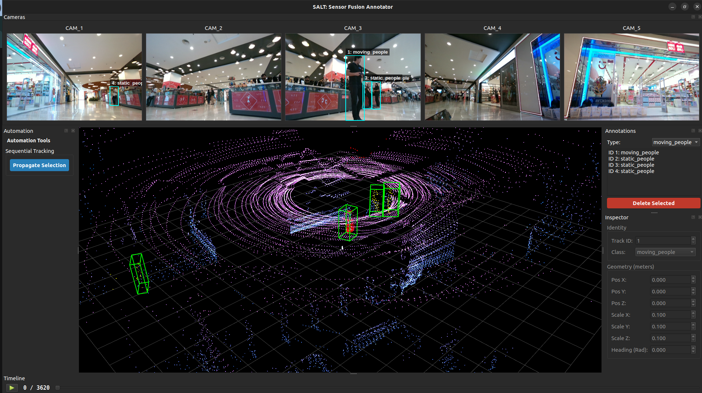

# SALT
[](https://releases.ubuntu.com/jammy/)

## 3D Sensor Fusion Annotation Tool
A production-grade PyQt6 application for labeling synchronized LiDAR point clouds and camera imagery.

### Features:

- Multi-view camera support (flexible config)
- 3D Cuboid annotation in LiDAR space
- SAM 2 auto-annotation integration
- Automatic Lidar-Camera projection

to run use
```python3
# Note: ensure that you have uv installed as per your OS
git clone https://github.com/LiDAR-Motion-Segmentation/SALT.git
cd SALT
curl -LsSf https://astral.sh/uv/install.sh | sh
uv sync
uv run main.py
```


## Directory Structure
```
├── config
│   ├── config.yaml
│   ├── models
│   │   └── default.yaml
│   └── salt_setup
│       ├── husky_setup.yaml
│       └── semantic_kitty.yaml
├── debug_config.py
├── main.py
├── pyproject.toml
├── README.md
├── requirements.txt
├── src
│   ├── core
│   │   ├── annotation_manager.py
│   │   ├── geometry.py
│   │   ├── objects.py
│   │   └── segmentation.py
│   ├── data
│   │   ├── data_controller.py
│   │   ├── interfaces.py
│   │   ├── loaders
│   │   │   └── realsense_loader.py
│   │   └── structures.py
│   └── ui
│       ├── components
|       |   ├── annotation_list.py
|       |   ├── automation_panel.py
│       │   ├── camera_view.py
│       │   ├── drawable_label.py
|       |   ├── inspector_view.py
│       │   ├── lidar_view.py
│       ├── interfaces.py
│       ├── main_window.py
│       ├── playback_widget.py
├── test
│   └── test_geometry.py
└── uv.lock
```

## Working


## Unit test
- for runing the unit tests use
```
uv run ruff check . --fix
uv run pytest 
```