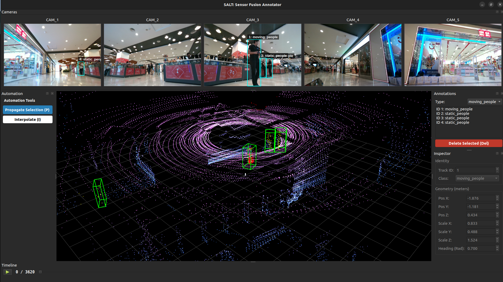

# SALT (Sensor Annotation & Labelling Tool)
[](https://github.com/LiDAR-Motion-Segmentation/SALT/actions/workflows/ci.yml)
[](https://releases.ubuntu.com/jammy/)

## 3D Sensor Fusion Annotation Tool
SALT is a high-performance, open-source annotation tool designed for sensor fusion tasks. It bridges the gap between 2D camera imagery and 3D LiDAR point clouds, offering AI-assisted labeling workflows to accelerate dataset creation for autonomous robotics.

### Features:

- Multi-Sensor Fusion: Seamlessly project 3D LiDAR points onto 2D camera frames and vice-versa.
- AI-Assisted Labeling: Integrated SAM 2 (Segment Anything Model) for one-click object segmentation.
- Automation Pipeline: Features linear propagation and "Copy-to-Next" automation to label sequences 10x faster.
- Semantic Point Clouds: Auto-colors LiDAR points based on the semantic class of the 2D bounding box.
- Split-State Saving: Decouples clean 3D datasets (.json) from editor metadata, ensuring compatibility with standard ML pipelines.
- Modular Config: Flexible YAML-based configuration for different robot platforms (e.g., Husky, SemanticKITTI).

## Installation
```python3
# SALT uses uv for blazing fast dependency management.
git clone https://github.com/LiDAR-Motion-Segmentation/SALT.git
cd SALT

# Install uv (if not already installed)
curl -LsSf https://astral.sh/uv/install.sh | sh

# Sync dependencies (creates virtual env automatically)
uv sync
uv run main.py
```


## Model weights
- Download the SAM 2 checkpoints and place them in the checkpoints/ directory (create if missing).
- [Download sam2_hiera_large.pt](https://github.com/facebookresearch/sam2)

## Controls & shortcuts
| Context | Key / Action | Description |
| :--- | :--- | :--- |
| **Navigation** | `Left Arrow` / `Right Arrow` | Previous / Next Frame |
| **Selection** | `Left Click` (3D View) | Select a Bounding Box |
| **Editing** | `Mouse Drag` (2D View) | Draw a new Box (Trigger SAM) |
| **Automation** | `P` | **Propagate** selected box to next frame |
| **Interpolation** | `I` | **Interpolate** selected box to next frame |
| **Management** | `Del` | Delete selected box |
| **System** | `Ctrl + S` | Force Save (Auto-save is on by default) |
| **3D View** | `Left Drag` / `Right Drag` | Rotate / Pan Camera |
| **3D View** | `Scroll` | Zoom In / Out |

## Data structure
- SALT expects your data to be organized as follows. Define the paths in `config/config.yaml`
```
/path/to/dataset/
├── velodyne/             # LiDAR Point Clouds (.pcd or .bin)
│   ├── 000000.pcd
│   └── ...
├── image_2/              # Camera Images
│   ├── 000000.png
│   └── ...
└── calib/                # Calibration Files
    ├── 000000.txt
    └── ...
```

## Architecture


## Directory Structure
- SALT follows a modular `Model-View-Controller (MVC)` pattern to separate UI logic from geometric processing.
```
├── config
│   ├── config.yaml
│   ├── models
│   │   └── default.yaml
│   └── salt_setup
│       ├── husky_setup.yaml
│       └── semantic_kitty.yaml
├── debug_config.py
├── main.py
├── pyproject.toml
├── README.md
├── requirements.txt
├── src
│   ├── core
│   │   ├── annotation_manager.py
│   │   ├── geometry.py
│   │   ├── objects.py
│   │   └── segmentation.py
│   ├── data
│   │   ├── data_controller.py
│   │   ├── interfaces.py
│   │   ├── loaders
│   │   │   └── realsense_loader.py
│   │   └── structures.py
│   └── ui
│       ├── components
|       |   ├── annotation_list.py
|       |   ├── automation_panel.py
│       │   ├── camera_view.py
│       │   ├── drawable_label.py
|       |   ├── inspector_view.py
│       │   ├── lidar_view.py
│       ├── interfaces.py
│       ├── main_window.py
│       ├── playback_widget.py
├── test
│   └── test_geometry.py
└── uv.lock
```


## Testing
- We use `pytest` for logic verification and `ruff` for linting
```bash
# Check code style
uv run ruff check . --fix

# Run the test suite
uv run pytest 
```