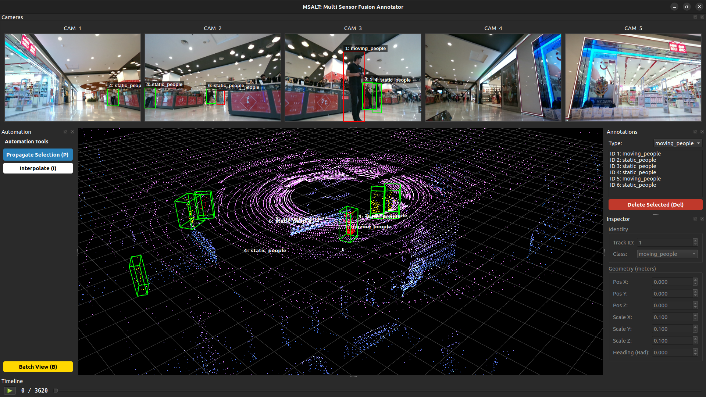

<div align="center">
  

# MSALT (Multi Sensor Annotation & Labelling Tool)
[](https://github.com/LiDAR-Motion-Segmentation/MSALT/actions/workflows/ci.yml)
[](https://releases.ubuntu.com/jammy/)
</div>

## 3D Sensor Fusion Annotation Tool
MSALT is a high-performance, open-source annotation tool designed for sensor fusion tasks. It bridges the gap between 2D camera imagery and 3D LiDAR point clouds, offering AI-assisted labeling workflows to accelerate dataset creation for autonomous robotics.

### Features:

- Multi-Sensor Fusion: Seamlessly project 3D LiDAR points onto 2D camera frames and vice-versa.
- AI-Assisted Labeling: Integrated SAM 2 (Segment Anything Model) for automatic object segmentation.
- Automation Pipeline: Features linear propagation and "Copy-to-Next" automation to label sequences 10x faster.
- Semantic Point Clouds: Auto-colors LiDAR points based on the semantic class of the 2D bounding box.
- Split-State Saving: Decouples clean 3D datasets (.json) from editor metadata, ensuring compatibility with standard ML pipelines.
- Modular Config: Flexible YAML-based configuration for different robot platforms (e.g., Husky, SemanticKITTI).
- Batch editing: Easy editing with multiple 3D bounding box view for a set of sequences.

## Installation
- You can setup the tool `locally` or using `Docker(Devcontainer)` setup whose intructions are mentioned towards the end of this `readme.md` file
```python3
# MSALT uses uv for blazing fast dependency management.
git clone https://github.com/LiDAR-Motion-Segmentation/MSALT.git
cd MSALT

# Install uv (if not already installed)
curl -LsSf https://astral.sh/uv/install.sh | sh

# Sync dependencies (creates virtual env automatically)
uv sync
uv run main.py
```


## Model weights
- Download the SAM 2 checkpoints and place them in the checkpoints/ directory (create if missing).
- [Download sam2_hiera_large.pt](https://github.com/facebookresearch/sam2)

## Controls & shortcuts
| Context | Key / Action | Description |
| :--- | :--- | :--- |
| **Navigation** | `Left Arrow` / `Right Arrow` | Previous / Next Frame |
| **Selection** | `Left Click` (3D View) | Select a Bounding Box |
| **Editing** | `Mouse Drag` (2D View) | Draw a new Box (Trigger SAM) |
| **Automation** | `P` | **Propagate** selected box to next frame |
| **Interpolation** | `I` | **Interpolate** selected box to next frame |
| **Management** | `Del` | Delete selected box |
| **System** | `Ctrl + S` | Force Save (Auto-save is on by default) |
| **Undo** | `Ctrl + Z` | Undo changes |
| **Redo** | `Ctrl + Y` | Redo changes |
| **3D Box Drawing** | `Ctrl + Left Click` | Draw a new Box in 3D | 
| **3D View** | `Left Drag` / `Right Drag` | Rotate / Pan Camera |
| **3D View** | `Scroll` | Zoom In / Out |
| **3D Box allignment** | `R` | PCA trigger for correct 3D box allignment |
| **Batch View** | `B` | Batch mode of (4x4) set of frames |


<!-- <video src="./assets/annotation_video_box_editing.mp4" controls title="A short video demonstration" width="600">
</video> -->

## Batch mode editing

- How it works :
1. Open Batch View (B).
2. You see 16 frames. Frame 10 has the box slightly too far left.
3. Click Frame 10. It glows Yellow.
4. Press D tap-tap-tap. The box moves right instantly.
5. Press Q. The box rotates slightly.

| Action        | Key       | Shift + Key     |
|---------------|-----------|-----------------|
| Forward/Back  | W / S     | Scale Length    |
| Left/Right    | A / D     | Scale Width     |
| Up/Down       | R / F     | Scale Height    |
| Rotate        | Q / E     | No Change       |

- We have also added the option of `top(XY)`, `side (XZ)`, `front (YZ)` and `reset` for better editing

## Input setup
- MSALT expects your data to be organized as follows. Define the paths in `config/msalt_setup/docker_setup.yaml` or make your own custom file with the paths
```
paths:
  lidar_folder: "/app/data/lidar"

  cameras:
    - id: "CAM_1"
      name: "Front Center"
      image_folder: "/app/data/camera1"
      intrinsics: "/app/data/camera1_intrinsics.txt"
      extrinsics: "/app/data/camera1_extrinsics.txt"
    - id: "CAM_2"
      name: "Front Left"
      image_folder: "/app/data/camera2"
      intrinsics: "/app/data/camera2_intrinsics.txt"
      extrinsics: "/app/data/camera2_extrinsics.txt"
    - id: "CAM_3"
      name: "Front Right"
      image_folder: "/app/data/camera3"
      intrinsics: "/app/data/camera3_intrinsics.txt"
      extrinsics: "/app/data/camera3_extrinsics.txt"
    - id: "CAM_4"
      name: "Rear Left"
      image_folder: "/app/data/camera4"
      intrinsics: "/app/data/camera4_intrinsics.txt"
      extrinsics: "/app/data/camera4_extrinsics.txt"
    - id: "CAM_5"
      name: "Rear Right"
      image_folder: "/app/data/camera5"
      intrinsics: "/app/data/camera5_intrinsics.txt"
      extrinsics: "/app/data/camera5_extrinsics.txt"

extensions:
  images: ".png"
  lidar: ".pcd"
```
- In `config/config.yaml` make the modification where you have put your desired file setup with the paths
```
defaults:
  - msalt_setup: <custom file setup name here>  
  - models: default
  - _self_
```

## Architecture


## Directory Structure
- MSALT follows a modular `Model-View-Controller (MVC)` pattern to separate UI logic from geometric processing.
```
├── config
│   ├── config.yaml
│   ├── models
│   │   └── default.yaml
│   └── msalt_setup
│       ├── husky_setup.yaml
│       └── semantic_kitty.yaml
├── Docker
│   ├── Dockerfile
│   └── run_docker.sh
├── debug_config.py
├── main.py
├── pyproject.toml
├── README.md
├── requirements.txt
├── src
│   ├── core
│   │   ├── annotation_manager.py
|   |   ├── commands.py
│   │   ├── geometry.py
│   │   ├── objects.py
│   │   └── segmentation.py
│   ├── data
│   │   ├── data_controller.py
│   │   ├── interfaces.py
│   │   ├── loaders
│   │   │   └── realsense_loader.py
│   │   └── structures.py
│   └── ui
│       ├── components
|       |   ├── annotation_list.py
|       |   ├── automation_panel.py
|       |   ├── batch_view.py
│       │   ├── camera_view.py
│       │   ├── drawable_label.py
|       |   ├── inspector_view.py
│       │   ├── lidar_view.py
│       ├── interfaces.py
│       ├── main_window.py
│       ├── playback_widget.py
├── test
│   └── test_geometry.py
└── uv.lock
```


## Testing
- We use `pytest` for logic verification and `ruff` for linting
```bash
# Check code style
uv run ruff check . --fix

# Run the test suite
uv run pytest 
```

## Docker (Devcontainer)
### Prerequisites

- **Ubuntu** (tested on 22.04)
- **VSCode**
- **Remote Development Extension by Microsoft** (Inside VSCode)
- **Docker Installation**
  ```bash
  # Install Docker using convenience script
  curl -fsSL https://get.docker.com -o get-docker.sh
  sudo sh ./get-docker.sh

  # Post-install configuration
  sudo groupadd docker
  sudo usermod -aG docker $USER

  # Verify if Docker service is enabled
  sudo systemctl is-enabled docker

  # If not enable it
  sudo systemctl enable docker.service
  sudo systemctl enable containerd.service
  ```
>[!IMPORTANT]
>**Reboot before proceeding further**

- [**Install the NVIDIA Container Toolkit**](http://docs.nvidia.com/datacenter/cloud-native/container-toolkit/latest/install-guide.html)
```
sudo apt-get install -y nvidia-container-toolkit
sudo nvidia-ctk runtime configure --runtime=docker
sudo systemctl restart docker
```
- **Enabling Nvidia GPU for simulation**

  | Hardware | Requirement  |
  | :------- | :----------- |
  | GPU      | CUDA-enabled |

  | Software      | Requirement                                                           |
  | :------------ | :-------------------------------------------------------------------- |
  | Nvidia Driver | - Ubuntu 22.04 `>=515.43.04` 
  
- Check [Docker docs](/docs/docker.md) for more information on docker and Nvidia.

```
# also run this command locally before proceding
xhost +local:docker
```
- Ensure that you change the filepath to load your directory in `.devcontainer/devcontainer.json`
```json
"mounts": [
        "source=/tmp/.X11-unix,target=/tmp/.X11-unix,type=bind",
        "source=<path for the data>,target=/app/data,type=bind",
        "source=<path for the annotations>,target=/app/annotations,type=bind"
    ],
```

- **Enter the container**
    - Open Command Pallete with `Ctrl+Shift+P`
    - Select **Dev Containers: Rebuild and Reopen in Container**
