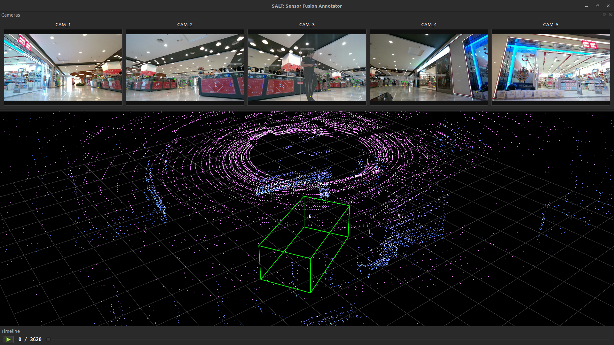

# SALT
[SALT]: Segment Annotate Label Track tool for annotating images and 3D pointclouds side by side with automation for improved efficiency and accuracy

## 3D Sensor Fusion Annotation Tool
A production-grade PyQt6 application for labeling synchronized LiDAR point clouds and camera imagery.

### Features:

- Multi-view camera support (flexible config)
- 3D Cuboid annotation in LiDAR space
- YOLO + SAM 2 auto-annotation integration
- Automatic Lidar-Camera projection

to run use
```python3
git clone https://github.com/LiDAR-Motion-Segmentation/SALT.git
cd SALT
uv sync
uv run main.py
```
