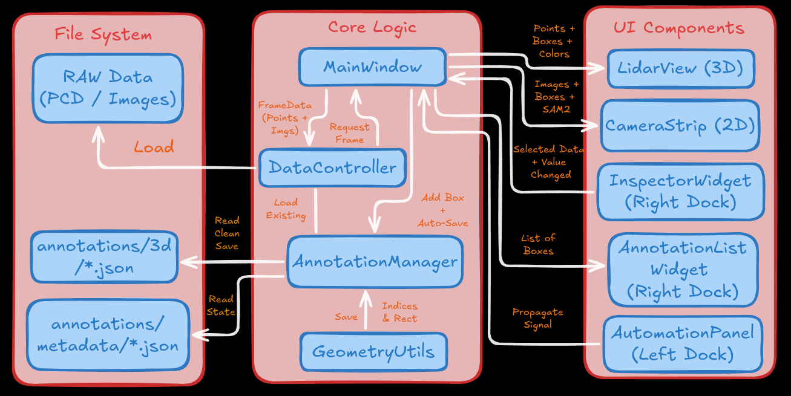
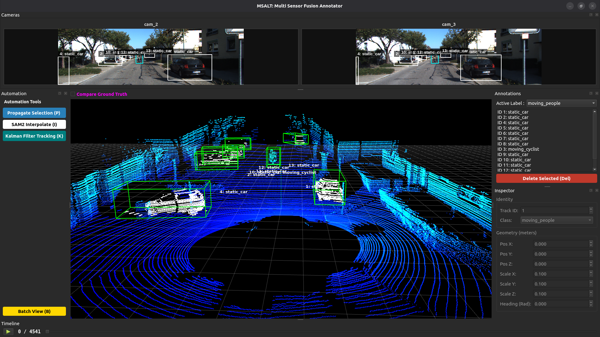

# Introduction to MSALT

<div align="center">
  <!--  -->

# MSALT (Multi Sensor Annotation & Labelling Tool)
<!-- [](https://github.com/LiDAR-Motion-Segmentation/MSALT/actions/workflows/ci.yml) -->
[](https://releases.ubuntu.com/jammy/)
</div>

## 3D Sensor Fusion Annotation Tool
MSALT is a high-performance, open-source annotation tool designed for sensor fusion tasks. It bridges the gap between 2D camera imagery and 3D LiDAR point clouds, offering AI-assisted labeling workflows to accelerate dataset creation for autonomous robotics.

### Features:

- Multi-Sensor Fusion: Seamlessly project 3D LiDAR points onto 2D camera frames and vice-versa.
- AI-Assisted Labeling: Integrated SAM 2 (Segment Anything Model) for automatic object segmentation.
- Automation Pipeline: Features linear propagation and "Copy-to-Next" automation to label sequences 10x faster.
- Semantic Point Clouds: Auto-colors LiDAR points based on the semantic class of the 2D bounding box.
- Split-State Saving: Decouples clean 3D datasets (.json) from editor metadata, ensuring compatibility with standard ML pipelines.
- Modular Config: Flexible YAML-based configuration for different robot platforms (e.g., Husky, SemanticKITTI).
- Batch editing: Easy editing with multiple 3D bounding box view for a set of sequences.

## Installation
- You can setup the tool `locally` or using `Docker(Devcontainer)` setup whose intructions are mentioned towards the end of this `readme.md` file
```python3
# MSALT uses uv for blazing fast dependency management.
git clone https://github.com/LiDAR-Motion-Segmentation/MSALT.git
cd MSALT

# Install uv (if not already installed)
curl -LsSf https://astral.sh/uv/install.sh | sh

# Sync dependencies (creates virtual env automatically)
uv sync

# on terminal in the root of the folder
chmod +x msalt
./msalt

# or use to run with uv
uv run main.py
```


## Model weights
- Download the SAM 2 checkpoints and place them in the directory.
- [Download sam2_hiera_large.pt](https://github.com/facebookresearch/sam2)
- Download the YOlO26 model and place them in the directory
- [Download yolo26l.pt](https://github.com/ultralytics/assets/releases/download/v8.4.0/yolo26l.pt)

<!-- <video src="./assets/annotation_video_box_editing.mp4" controls title="A short video demonstration" width="600">
</video> -->


## Architecture


## Algorithmic Math behind the tool
- 2D-3D back projection math
- Attaching link of the slide deck with in-depth math review and analysis [slides](https://docs.google.com/presentation/d/1bkxz266cf_2n2TrYOkVyRwoABM5PNmgjnWyLDB4iWXU/edit?usp=sharing)


## Directory Structure
- MSALT follows a modular `Model-View-Controller (MVC)` pattern to separate UI logic from geometric processing.
```
├── config
│   ├── config.yaml
│   ├── models
│   │   └── default.yaml
│   └── msalt_setup
│       ├── husky_setup.yaml
│       └── semantic_kitty.yaml
├── Docker
│   ├── Dockerfile
│   └── run_docker.sh
├── debug_config.py
├── main.py
├── pyproject.toml
├── README.md
├── requirements.txt
├── src
│   ├── core
│   │   ├── annotation_manager.py
|   |   ├── commands.py
│   │   ├── geometry.py
│   │   ├── objects.py
│   │   ├── segmentation.py
│   │   └── tracker.py
│   ├── data
│   │   ├── data_controller.py
│   │   ├── interfaces.py
│   │   ├── loaders
│   │   │   └── realsense_loader.py
│   │   └── structures.py
│   └── ui
│       ├── components
|       |   ├── annotation_list.py
|       |   ├── automation_panel.py
|       |   ├── batch_view.py
|       |   ├── camera_modal.py
│       │   ├── camera_view.py
│       │   ├── drawable_label.py
|       |   ├── inspector_view.py
│       │   ├── lidar_view.py
│       ├── interfaces.py
│       ├── main_window.py
│       ├── playback_widget.py
├── test
|   ├── test_annotation_manager.py
|   ├── test_commands.py
│   └── test_geometry.py
└── uv.lock
```

## NuScenes dataset Benchmarking
- Alot of modifications were required to have Nuscenes dataset on this tool as per benchmarking requests
- a seperate branch exists called `perf/nuscenes` where the code changes for Nuscenes exists
- a seperate config exits called `nuscenes.yaml` where you can choose the paths and the sequence
```
name: "nuscenes_mini"

dataset_type: "nuscenes"
version: "v1.0-mini"

paths:
  # The root folder containing 'samples', 'sweeps', 'maps', 'v1.0-mini'
  root_dir: "/home/Downloads/v1.0-mini"
  scenes: [1]

extensions:
  images: ".jpg"
  lidar: ".pcd.bin"
```
- post the changes go to `config.yaml`, change the `msalt_setup` to
```
defaults:
  - msalt_setup: nuscenes  
  - models: default
  - _self_
```
- to try it out use the steps below
```
git checkout perf/nuscenes
uv sync

# run this
uv run main.py

# OR
./msalt
```


## Semantic Kitti dataset Benchmarking
- Make changes in the config paths in the same way in the `perf/nuscenes` branch code
```
name: "semantic_kitti"

dataset_type: "semantic_kitti"

# Dataset Settings
paths:
  root_dir: "/home/Downloads/semantic-kitty/sequences" 
  sequence_id: "00"

# Set to null to load ALL frames found in the folder
num_frames: null
iou_threshold: 0.5 

# SemanticKITTI Class ID -> Label Name Mapping
# IDs found in standard semantic-kitti.yaml API
label_mapping:
  10: "Car"        # car
  11: "Car"        # bicycle
  13: "Bus"        # bus
  15: "Truck"      # truck
  18: "Truck"      # construction vehicle
  20: "Truck"      # other-vehicle
  30: "Pedestrian" # person
  31: "Cyclist"    # bicyclist
  32: "Cyclist"    # motorcyclist
  252: "Car"       # moving-car
  253: "Cyclist"   # moving-bicyclist
  254: "Pedestrian"# moving-person
  255: "Cyclist"   # moving-motorcyclist
  256: "Car"       # moving-on-rails
  257: "Bus"       # moving-bus
  258: "Truck"     # moving-truck
  259: "Truck"     # moving-other-vehicle
```
- post the changes go to `config.yaml`, change the `msalt_setup` to the following and then run the tool.
```
defaults:
  - msalt_setup: semantic-kitti  
  - models: default
  - _self_
```



## Acknowledgement
- I would like to thank my advisor [Dr. K. Madhava Krishna](https://madhavak-iiith.github.io/), IIIT Hyderabad for guiding me through this project and also my collaborators for advice
- I have taken a lot of ideas from [SALT](https://github.com/anuragxel/salt) , [SUSTechpoints](https://github.com/naurril/SUSTechPOINTS), [SematicKITTI_LABLER](https://github.com/jbehley/point_labeler) open source tools.

## Citation
```
@article{ravi2024sam2,
  title={SAM 2: Segment Anything in Images and Videos},
  author={Ravi, Nikhila and Gabeur, Valentin and Hu, Yuan-Ting and Hu, Ronghang and Ryali, Chaitanya and Ma, Tengyu and Khedr, Haitham and R{\"a}dle, Roman and Rolland, Chloe and Gustafson, Laura and Mintun, Eric and Pan, Junting and Alwala, Kalyan Vasudev and Carion, Nicolas and Wu, Chao-Yuan and Girshick, Ross and Doll{\'a}r, Piotr and Feichtenhofer, Christoph},
  journal={arXiv preprint arXiv:2408.00714},
  url={https://arxiv.org/abs/2408.00714},
  year={2024}
}

@INPROCEEDINGS{9304562,
  author={Li, E and Wang, Shuaijun and Li, Chengyang and Li, Dachuan and Wu, Xiangbin and Hao, Qi},
  booktitle={2020 IEEE Intelligent Vehicles Symposium (IV)}, 
  title={SUSTech POINTS: A Portable 3D Point Cloud Interactive Annotation Platform System}, 
  year={2020},
  volume={},
  number={},
  pages={1108-1115},
  doi={10.1109/IV47402.2020.9304562}
  } 

@article{wang2025salt,
  title={SALT: A Flexible Semi-Automatic Labeling Tool for General LiDAR Point Clouds with Cross-Scene Adaptability and 4D Consistency},
  author={Wang, Yanbo and Chen, Yongtao and Cao, Chuan and Deng, Tianchen and Zhao, Wentao and Wang, Jingchuan and Chen, Weidong},
  journal={arXiv preprint arXiv:2503.23980},
  year={2025}
}

@inproceedings{behley2019iccv,
  author = {J. Behley and M. Garbade and A. Milioto and J. Quenzel and S. Behnke and C. Stachniss and J. Gall},
  title = {{SemanticKITTI: A Dataset for Semantic Scene Understanding of LiDAR Sequences}},
  booktitle = {Proc. of the IEEE/CVF International Conf.~on Computer Vision (ICCV)},
  year = {2019}
}

@INPROCEEDINGS{nuscenes,
  title={nuScenes: A multimodal dataset for autonomous driving},
  author={Holger Caesar and Varun Bankiti and Alex H. Lang and Sourabh Vora and 
          Venice Erin Liong and Qiang Xu and Anush Krishnan and Yu Pan and 
          Giancarlo Baldan and Oscar Beijbom}, 
  booktitle={CVPR},
  year=2020
}
```