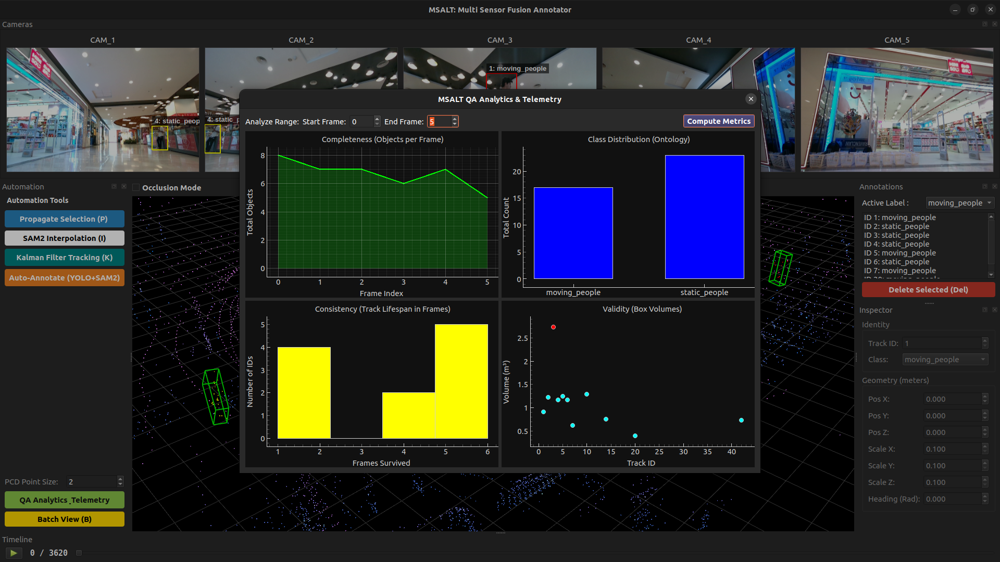

# QA Analytics

MSALT includes a built in telemetry dashboard designed to provide quantitative Quality Assurance (QA) for your dataset. By visualizing annotation metadata across a sequence, you can instantly spot tracking failures, unbalanced ontologies, and geometrically invalid bounding boxes without manually inspecting thousands of frames.

To access the dashboard, click the green **QA Analytics & Telemetry** button in the Automation Panel or use the shortcut `Ctrl+Shift+A`.

---

## 1. Completeness (Objects per Frame)
**Graph Type:** Line Chart
**Purpose:** Measures the density and temporal continuity of your annotations.

* **How it is computed:** The system iterates through the selected frame range and simply counts the total number of valid `BoundingBox3D` objects present in each frame.
* **How to read it:** You should see a relatively smooth, continuous line. 
    * If the line abruptly drops to zero in the middle of a sequence, it means frames were skipped or annotations were accidentally deleted. 
    * Sudden, massive spikes might indicate that an auto-annotator or human hallucinated a large number of false positives in a single frame.

## 2. Class Distribution (Ontology)
**Graph Type:** Bar Chart
**Purpose:** Analyzes the class balance of your dataset for Machine Learning training.

* **How it is computed:** The system tallies the frequency of every unique `box.label` across the entire selected frame range.
* **How to read it:** This instantly highlights the "long-tail" distribution of your data. If you have 5,000 `car` annotations but only 12 `pedestrian` annotations, you know you need to source more pedestrian-heavy sequences before training your multi-object tracking models, otherwise, the model will be heavily biased.

## 3. Consistency (Track Lifespan)
**Graph Type:** Histogram
**Purpose:** Evaluates the health of your temporal tracking and ID assignments.

* **How it is computed:** The system groups all boxes by their `track_id`. It counts how many total frames each unique ID exists in, and plots the distribution of those lifespans into bins.
* **How to read it:** A healthy tracking sequence should have a high number of long-lifespan IDs (e.g., objects existing for 50+ frames). 
    * If your histogram is heavily skewed to the left (meaning hundreds of IDs only survive for 1 to 5 frames), your tracking is failing. This implies that the tracker is constantly losing objects and spawning brand-new IDs for the same physical object ("ID switching").

## 4. Validity (Box Volume Outliers)
**Graph Type:** Scatter Plot with Outlier Highlighting
**Purpose:** Mathematically identifies physically impossible bounding boxes.

* **How it is computed:** For every unique `track_id`, the system calculates the physical 3D volume using the formula: Volume = dx X dy X dz. It plots the maximum volume achieved by that ID. The system then calculates the mean and standard deviation of all volumes. Any box volume that exceeds two standard deviations from the mean is flagged with a red color.
* **How to read it:** * **Cyan dots:** Normal, expected object sizes.
    * **Red dots:** Critical geometric errors. If you see a red dot sitting at 150m^3, it means an annotator accidentally dragged the height or length of a box to an impossible size (a "flying cuboid" or "extrusion error"). Hovering over or identifying the X-axis value gives you the exact `track_id` so you can jump directly to it and fix it.