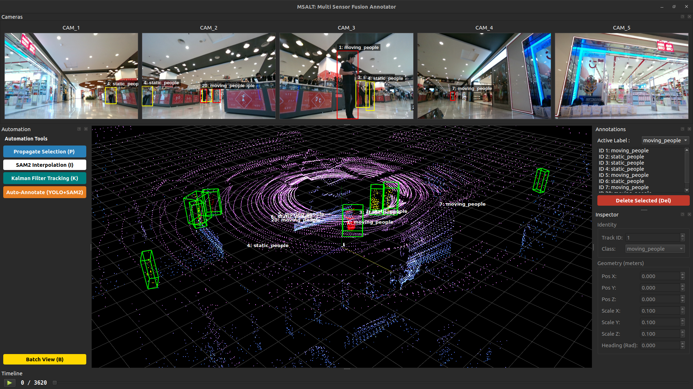

# Installation

- You can setup the tool `locally` or using `Docker(Devcontainer)` setup whose intructions are mentioned towards the end of this `readme.md` file
```python3
# MSALT uses uv for blazing fast dependency management.
git clone https://github.com/LiDAR-Motion-Segmentation/MSALT.git
cd MSALT

# Install uv (if not already installed)
curl -LsSf https://astral.sh/uv/install.sh | sh

# Sync dependencies (creates virtual env automatically)
uv sync

# on terminal in the root of the folder
chmod +x msalt
./msalt

# or use to run with uv
uv run main.py
```


## Model weights
- Download the SAM 2 checkpoints and place them in the directory.
- [Download sam2_hiera_large.pt](https://github.com/facebookresearch/sam2)
- Download the YOlO26 model and place them in the directory
- [Download yolo26l.pt](https://github.com/ultralytics/assets/releases/download/v8.4.0/yolo26l.pt)

## Docker (Devcontainer)
### Prerequisites

- **Ubuntu** (tested on 22.04)
- **VSCode**
- **Remote Development Extension by Microsoft** (Inside VSCode)
- **Docker Installation**
  ```bash
  # Install Docker using convenience script
  curl -fsSL https://get.docker.com -o get-docker.sh
  sudo sh ./get-docker.sh

  # Post-install configuration
  sudo groupadd docker
  sudo usermod -aG docker $USER

  # Verify if Docker service is enabled
  sudo systemctl is-enabled docker

  # If not enable it
  sudo systemctl enable docker.service
  sudo systemctl enable containerd.service
  ```
>[!IMPORTANT]
>**Reboot before proceeding further**

- [**Install the NVIDIA Container Toolkit**](http://docs.nvidia.com/datacenter/cloud-native/container-toolkit/latest/install-guide.html)
```
sudo apt-get install -y nvidia-container-toolkit
sudo nvidia-ctk runtime configure --runtime=docker
sudo systemctl restart docker
```
- **Enabling Nvidia GPU for simulation**

  | Hardware | Requirement  |
  | :------- | :----------- |
  | GPU      | CUDA-enabled |

  | Software      | Requirement                                                           |
  | :------------ | :-------------------------------------------------------------------- |
  | Nvidia Driver | - Ubuntu 22.04 `>=515.43.04` 
  

```
# also run this command locally before proceding
xhost +local:docker
```
- Ensure that you change the filepath to load your directory in `.devcontainer/devcontainer.json`
```json
"mounts": [
        "source=/tmp/.X11-unix,target=/tmp/.X11-unix,type=bind",
        "source=<path for the data>,target=/app/data,type=bind",
        "source=<path for the annotations>,target=/app/annotations,type=bind"
    ],
```

- **Enter the container**
    - Open Command Pallete with `Ctrl+Shift+P`
    - Select **Dev Containers: Rebuild and Reopen in Container**