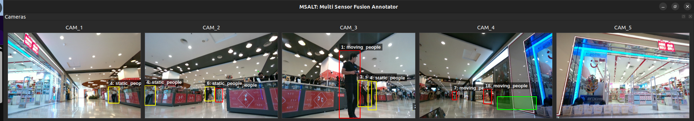
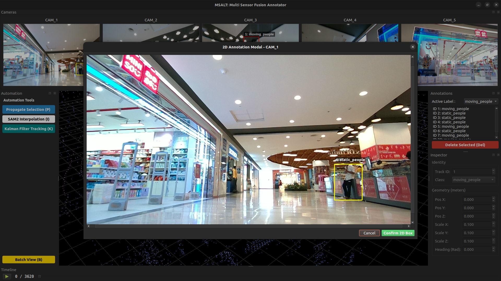

# 2D Camera Strip &amp; Pop-Out Modal

## 2D Camera Strip
- in this strip you can draw a box like this image using mouse `left click`, where I am trying to draw a green box on the strip
- there is also an option of image override using shift but I wouldnt recommend it

## Camera pop out modality
- This mode can be enabled by using a `right click` on the image panel

