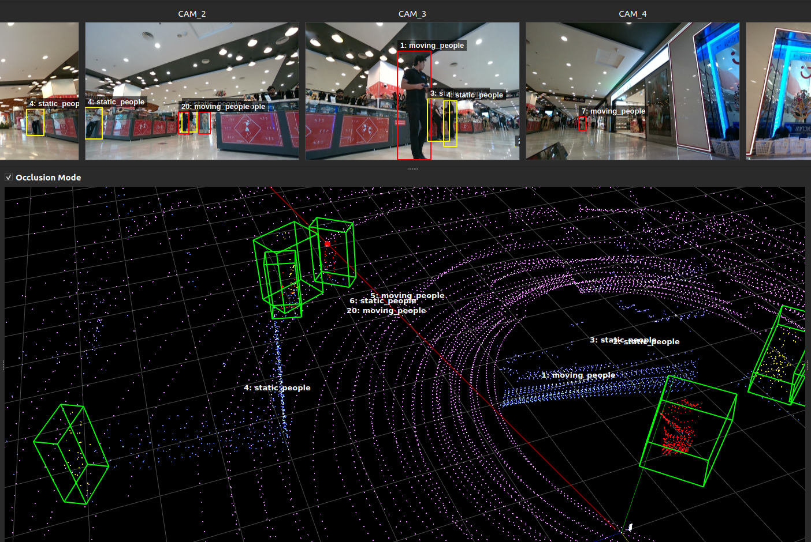

## Occlusion Mode

This document explains the math used in `_handle_camera_hover` to back‑project a 2D image pixel into a 3D ray in LiDAR space and pick an occlusion‑aware hit point on the point cloud.



### 1. From pixel to camera‑frame ray

Given:
- Pixel coordinates \((u, v)\)
- Camera intrinsic matrix \(K \in \mathbb{R}^{3\times 3}\)

We first build a ray in the camera frame

This yields an (unnormalized) 3D direction vector in camera coordinates.

### 2. Camera ray to LiDAR frame

Let the camera→LiDAR pose be


where:
- \R is the rotation from camera frame to LiDAR frame
- \t is the camera origin expressed in LiDAR coordinates

<!-- Then:

- Ray origin in LiDAR:
\[
\text{origin}_\text{lidar} = t
\]

- Ray direction in LiDAR:
\[
\tilde{r}_\text{lidar} = R \,\text{ray}_\text{cam}
\]
\[
\text{ray}_\text{lidar} =
\frac{\tilde{r}_\text{lidar}}{\left\lVert \tilde{r}_\text{lidar} \right\rVert}
\] -->

### 3. Occlusion‑aware hit point on the point cloud

Let the LiDAR point cloud (in LiDAR frame) be \(\{P_i\}_{i=1}^N\), \(P_i \in \mathbb{R}^3\).

1. **Vector from camera origin to each point**
<!-- \[
v_i = P_i - \text{origin}_\text{lidar}
\] -->

2. **Depth along the ray**
<!-- \[
t_i = v_i \cdot \text{ray}_\text{lidar}
\] -->

We ignore points behind the camera:
<!-- \[
t_i > 0
\] -->

3. **Perpendicular distance to the ray**

<!-- Project \(v_i\) onto the ray:
\[
\text{proj}_i = t_i \,\text{ray}_\text{lidar}
\]

Rejection (component orthogonal to the ray) and its norm:
\[
r_i = v_i - \text{proj}_i
\]
\[
d_i = \left\lVert r_i \right\rVert
\] -->

4. **Choose the visible hit**

Define a small distance threshold \(\varepsilon\) (e.g. \(0.3\) m).  
We consider only points that the ray passes “through”:

<!-- \[
d_i < \varepsilon
\] -->

Among these, the visible surface point is the one closest along the ray (smallest positive depth):

<!-- \[
i^\* = \arg\min_{i} \{\, t_i \mid t_i > 0,\ d_i < \varepsilon \,\}
\]

If such an index \(i^\*\) exists, the occlusion‑aware hit point is
\[
\text{hit\_point} = P_{i^\*}.
\] -->
Otherwise, no hit point is reported (only the infinite ray is drawn).

### 4. Rendering in the LiDAR view

The UI passes:
- `origin = cam_origin_lidar = origin_lidar`
- `direction = ray_lidar`
- `hit_point = P_{i*}` or `None`

to:

```python
self.lidar_widget.update_laser_pointer(origin, direction, hit_point)
```

which draws a long red ray and, when available, a red blob at the selected 3D hit point on the point cloud.

# Occlusion Mode

Given pixel 
<!-- (
u
,
v
)
(u,v), intrinsic 
K
K, and Camera→LiDAR pose 
E
E:
Pixel → camera-frame ray
Compute 
K
−
1
K 
−1
  once:
ray
cam
=
K
−
1
[
u
v
1
]
ray 
cam
​
 =K 
−1
  
​
  
u
v
1
​
  
​
 
This yields an unnormalized 3D direction in the camera frame.
Camera ray → LiDAR frame
Let 
E
=
[
R
 
∣
 
t
]
E=[R ∣ t] be the 4×4 extrinsic where:
R
R is the rotation from camera to LiDAR.
t
t is the camera origin expressed in LiDAR coordinates.
Then:
Ray origin in LiDAR: 
origin
lidar
=
t
origin 
lidar
​
 =t
Ray direction in LiDAR:
ray
lidar
=
R
⋅
ray
cam
,
ray
lidar
←
ray
lidar
∥
ray
lidar
∥
ray 
lidar
​
 =R⋅ray 
cam
​
 ,ray 
lidar
​
 ← 
∥ray 
lidar
​
 ∥
ray 
lidar
​
 
​
 
Occlusion-aware hit point
With point cloud points 
P
i
P 
i
​
  in LiDAR frame:
Vectors from camera origin to each point:
v
i
=
P
i
−
origin
lidar
v 
i
​
 =P 
i
​
 −origin 
lidar
​
 
Depth along the ray:
t
i
=
v
i
⋅
ray
lidar
t 
i
​
 =v 
i
​
 ⋅ray 
lidar
​
 
Keep only points in front of the camera: 
t
i
>
0
t 
i
​
 >0.
For those, compute perpendicular distance to the ray:
proj
i
=
t
i
⋅
ray
lidar
,
r
i
=
v
i
−
proj
i
,
d
i
=
∥
r
i
∥
proj 
i
​
 =t 
i
​
 ⋅ray 
lidar
​
 ,r 
i
​
 =v 
i
​
 −proj 
i
​
 ,d 
i
​
 =∥r 
i
​
 ∥
Identify points with 
d
i
<
0.3
d 
i
​
 <0.3 m and choose the one with minimum 
t
i
t 
i
​ -->
  (closest along the ray) as the true occlusion-aware hit.
Send to the LiDAR viewer
Use the camera-origin ray and the chosen hit:
origin = cam_origin_lidar
direction = ray_lidar
hit_point = selected 3D point or None
Pass them to self.lidar_widget.update_laser_pointer(origin, direction, hit_point).
