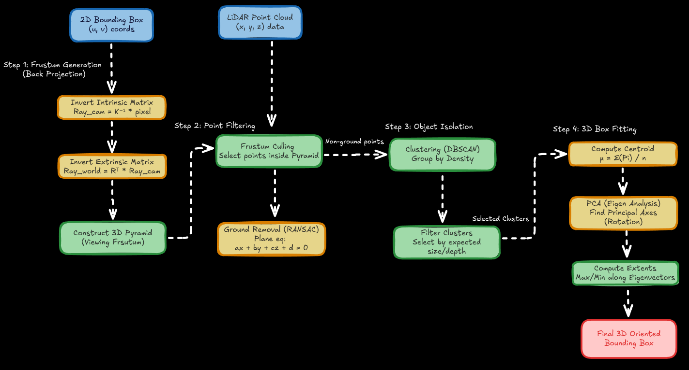

# Interpolation (SAM2 + PCA)

While the Kalman filter is great for simple linear movement, real-world objects turn, stop, and change shape as the sensor perspective shifts. **Smart Interpolation** solves this by dynamically re-fitting the bounding box to the object's physical shape in every frame using AI and geometry.

This is the most accurate way to track an object through a complex dataset.



## How to Use It

1. **Select an Object:** Ensure a bounding box is selected in the current frame.
2. **Trigger Interpolation:** Click the **SAM2 Interpolate (I)** button in the Automation Panel, or press the **`I`** hotkey.
3. **Review:** MSALT will intelligently track the object forward, re-running the SAM2 segmentation and PCA geometry fitting for each subsequent frame.


## Under the Hood: The Smart Tracking Pipeline

When you trigger the Smart Interpolation pipeline, MSALT executes the following loop for every future frame up to your configured `track_horizon`:

1. **3D-to-2D Projection:** The system takes the bounding box from the previous frame and mathematically projects it onto the 2D camera images of the *current* frame. It finds which camera offers the best view of the object.
2. **SAM2 Masking:** The projected 2D box is passed to the Segment Anything 2 (SAM2) model to extract a fresh, pixel-perfect boolean mask of the object in its new position.
3. **LiDAR Extraction:** The 3D LiDAR point cloud is projected onto the camera view. Points that land perfectly inside the new SAM2 mask are extracted.
4. **PCA Box Fitting:** The extracted LiDAR points are passed to the `GeometryUtils.fit_box_with_pca` engine. 
    * **DBSCAN** removes any spatial noise (like the road surface or a nearby pole).
    * **PCA (Principal Component Analysis)** determines the object's new physical orientation and heading.
    * A fresh 3D bounding box is fitted tightly around the points and saved to the frame.

### The LiDAR Fallback

If SAM2 fails to generate a mask usually because the object drove off-screen or was heavily occluded by a building MSALT gracefully falls back to a pure LiDAR tracking method. 
* It takes the bounding box from the previous frame and expands its search radius by 1.0 meter in the `X` and `Y` directions. 
* It searches for raw LiDAR points in this expanded region and runs the PCA clustering algorithm directly on those points to guess where the object moved. If it finds enough points, the track survives!

## Configuration

You can tune the sensitivity of the PCA fitting in your `config.yaml`:

```yaml
geometry:
  fit_box_with_pca:
    eps: 0.5          # DBSCAN cluster radius (meters)
    min_samples: 10    # Minimum points required to form a cluster
```